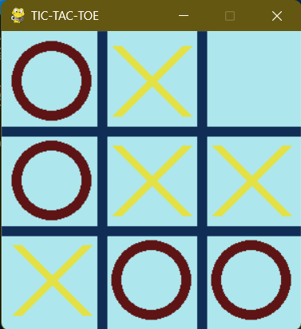
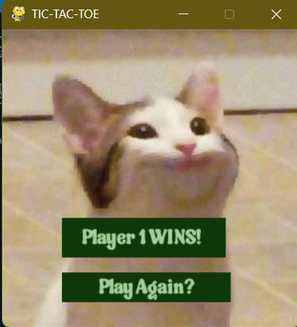

# 🎮 Tic-Tac-Toe Game  
**Created by Aleena Elza Mathew**

A fun, colorful take on the classic **Tic-Tac-Toe** built using **Python** and **Pygame**. This project features a clean graphical interface, two-player gameplay, and a charming little celebratory cat gif when someone wins. 🐱🎉

---

## 🚀 Features

✅ **Beautiful GUI**  
Clean 3x3 grid rendered with Pygame’s drawing functions and smooth colors.

👥 **2-Player Local Gameplay**  
Play with a friend — players alternate turns using "X" (yellow) and "O" (red).

🏆 **Auto Win/Draw Detection**  
The game immediately identifies wins (row/col/diagonal) or a draw if the board is full.

🔁 **Replay Option**  
Click "Play Again?" to restart the game instantly.

🎨 **Custom Styling**  
Easily tweak fonts, colors, and even images to match your vibe.

---

## 🎮 Live overview



## 🛠 Installation

1. Make sure Python is installed.  
2. Install the required package:
   ```bash
   pip install pygame
   ```
3. Clone or download this repo.

---

## ▶️ How to Play

1. Run the game:
   ```bash
   python tic_tac_toe.py
   ```
2. A game window will pop up.
3. Click a square to place your mark.
4. Watch the game declare the winner — or cry when it’s a draw. 😅
5. Hit "Play Again?" to restart and settle the score!

---

## 📁 File Overview

| File | Description |
|------|-------------|
| `tic_tac_toe.py` | Main game logic and rendering |
| `sauce.otf` | Custom font used for in-game text |
| `cat.gif` | Displayed when someone wins (because why not?) 🐈

---

## 💡 Code Highlights

- **Grid Rendering**: Crisp lines using `pygame.draw.line` make the 3x3 board pop.
- **Dynamic Click Handling**: Click-based move selection mapped perfectly to cell positions.
- **Victory & Draw Detection**: Smart logic checks for game-end conditions.
- **Interactive UI**: Game resets with a single click on the custom "Play Again?" button.

---

## 🌱 Future Ideas

- 🤖 Add an AI bot to challenge yourself.
- 🔊 Throw in sound effects for moves and wins.
- 📊 Add a scoreboard to track wins over multiple rounds.

---
## ✨ A CS50P project

## 🙌 Credits

- Made with ❤️ using Python and [Pygame](https://www.pygame.org).
- Font and GIFs customized for a more lively game experience.
